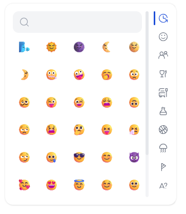
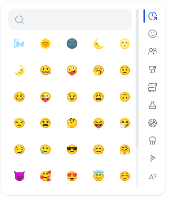
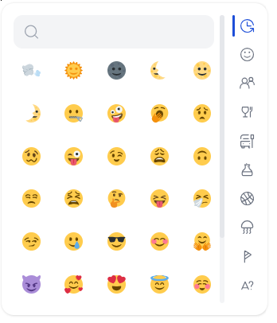

# Faz Quill Emoji
Faz Quill Emojis is a module that provides the functionality to easily add emojis to the Quill rich text editor with support for multiple open-source emoji collections such as: `openmoji`, `twemoji`, `noto`, `fluent-emoji`, `fluent-emoji-flat`, `fluent-emoji-high-contrast`, `noto-v1`, `emojione`, `emojione-monotone`, `emojione-v1`, `fxemoji`, `streamline-emojis` always prioritizing being lightweight and powerful.

|   |    |    |
|---|---|---|

## Quickstart

### Installation

Install with npm:

```
npm i faz-quill-emoji
```

#### Use as ES6 module (recommended):

Manual Registration:

```
import Quill from 'quill';
import RegisterFazQuillEmoji from "faz-quill-emoji";

RegisterFazQuillEmoji(Quill);

const quill = new Quill('#editor', {
    theme: 'snow',
    modules: {
        toolbar: {
            container: ['bold', 'italic', 'underline', 'strike', 'faz-emoji'],
            handlers: {
                'faz-emoji': true  
            },
        },
        fazEmoji: {
            collection: 'fluent-emoji'
        }
    }
});
```

Automatic registration:

```
import Quill from 'quill';
import "faz-quill-emoji/autoregister";

const quill = new Quill('#editor', {
    theme: 'snow',
    modules: {
        toolbar: {
            container: ['bold', 'italic', 'underline', 'strike', 'faz-emoji'],
            handlers: {
                'faz-emoji': true  
            },
        },
        fazEmoji: {
            collection: 'fluent-emoji'
        }
    }
});
```

#### Import styles

Styles are present under

```
import "faz-quill-emoji/dist/faz.quill.emoji.css";
```


### Not using a package manager or bundler?

Use the standalone files like this:

```
<!-- Quill editor core -->
<link href="https://cdn.jsdelivr.net/npm/quill@2.0.2/dist/quill.snow.css" rel="stylesheet">
<script src="https://cdn.jsdelivr.net/npm/quill@2.0.2/dist/quill.js"></script>


<!-- Module Faz quill emoji -->
<link
  rel="stylesheet"
  href="https://unpkg.com/faz-quill-emoji@0.1.0/dist/faz.quill.emoji.css"
  type="text/css"
/>
<script src="https://unpkg.com/faz-quill-emoji@0.1.0"></script>

<div id="editor"></div>

<script>
    const quill = new Quill('#editor', {
        theme: 'snow',
        modules: {
            toolbar: {
                container: ['bold', 'italic', 'underline', 'strike', 'faz-emoji'],
                handlers: {
                    'faz-emoji': true  
                },
            },
            fazEmoji: {
                collection: 'fluent-emoji'
            }
        }
    });
</script>
```

### Examples

All the examples described are in the [Demo](./demo) folder

1. [Basic](./demo/index.html)
2. [Popper Positioning](./demo/index.html)
3. [Open the drop-down menu from outside the editor](./demo/index.html)
4. [A beautiful collection of 'twemoji' emojis](./demo/index.html)
5. [A beautiful collection of 'fluent-emojis' emojis](./demo/index.html)


### Example options

```
const quill = new Quill('#editor', {
    theme: 'snow',
    modules: {
        toolbar: {
            container: ['bold', 'italic', 'underline', 'strike', 'faz-emoji'],
            handlers: {
                'faz-emoji': true  
            },
        },
        fazEmoji: {
            collection: 'fluent-emoji', 
            rewriteCDNURL(url) {
                return url;
            },
            popperOptions: null,
            popper: window.Popper
        }
    }
});
```

### Options

| name          | type     | description                                                                                                                                                                                                                                                                  |
|---------------|----------|------------------------------------------------------------------------------------------------------------------------------------------------------------------------------------------------------------------------------------------------------------------------------|
| collection    | string   | Collection of emoji to display. Allowed values: 'native' ,  'openmoji' ,  'twemoji' ,  'noto' ,  'fluent-emoji' ,  'fluent-emoji-flat' ,  'fluent-emoji-high-contrast' ,  'noto-v1' ,  'emojione' ,  'emojione-monotone' ,  'emojione-v1' ,  'fxemoji' ,  'streamline-emojis'. Default: 'native' |
| popper        | object   | The [popper library](https://popper.js.org/docs/v2/#usage) for more advanced drop-down menu positioning.                                                                                                                                                                                                             |
| popperConfig  | object   | Specify Popper's custom options. This gives you full control over the drop-down positioning. See [Popper's docs](https://popper.js.org/docs/v2/) for more details.                                                                                                                                             |
| rewriteCDNURL(url) | function | Emoji images, with the exception of 'native', come from a cdn if you want to rewrite this url you must use this option. asynchronous functions are accepted                                                                                                                  |


### Methods

You may retrieve the module from Quill like `quill.getModule('fazEmoji')` then call one of the imperative methods below.

| method   | description              |
|----------|--------------------------|
| openMenu | Open the drop-down menu. |